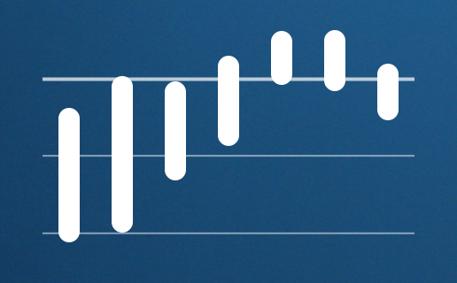

#minimal-forecast.widget
A clean and understated forecast widget for [Übersicht][uber] that just shows you the temperature trend over the next week. Click on a day to see the high and low. 

##Setup
This widget requires an API key from the [Dark Sky API][api]. Before you use this widget, open `minimal-forecast.coffee`, and change the variable `apiKey` to the key you got from Dark Sky.

##Configuration
There are four configuration variables at the top:

| Name | Default Value | Description |
| ---  | ---           | ---         |
| `apiKey` | *none* | See above |
| `gridlinesEvery` | 10 | The distance, in degrees, between the gridlines on the graph. |
| `units` | `"auto"` | Temperature units to use. `auto`, the default, automatically selects units based on location. Other options include `si` for Celsius and `us` for Fahrenheit. See the [API documentation][units] for more information. |
| `apparentTemps` | `false` | Display apparent temperatures instead of actual temperatures. This may include windchill, humidex, etc. |

[api]: http://darksky.net/dev
[uber]: http://tracesof.net/uebersicht
[units]: https://darksky.net/dev/docs/forecast
